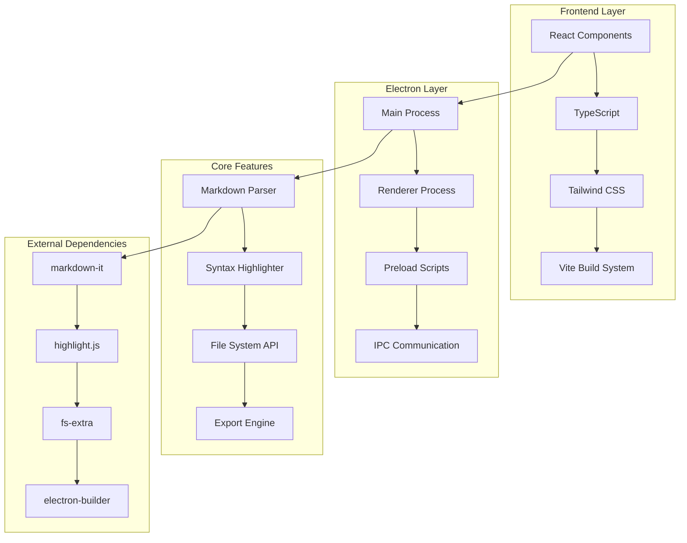

<div align="center">
  
  
  # MDoc - Modern Markdown Editor
  
  [](https://github.com/your-username/mdoc/releases)
  [](LICENSE)
  [](https://github.com/your-username/mdoc/releases)
  [](https://electronjs.org/)
  
  **A modern, feature-rich Markdown editor built with Electron, React, and TypeScript**
  
  [📥 Download Latest Release](https://github.com/your-username/mdoc/releases/latest) | [📖 Documentation](#documentation) | [🐛 Report Bug](https://github.com/your-username/mdoc/issues) | [💡 Request Feature](https://github.com/your-username/mdoc/issues)
</div>

---

## ✨ Features

### 📁 **Project Management**
- **Folder-based workflow** - Open entire project folders
- **Smart file tree** - Automatically excludes `.gitignore` and `node_modules`
- **Real-time file watching** - Detects changes in the file system
- **Multi-file support** - Switch between multiple Markdown files seamlessly

### ✏️ **Advanced Editor**
- **Real-time Markdown editing** with live preview
- **Auto-save functionality** (saves after 1 second of inactivity)
- **Monaco editor** with syntax highlighting
- **Line numbers** and cursor position display
- **Customizable themes** (Light/Dark mode)

### 👁️ **Rich Preview**
- **Live preview** with Qiita-style rendering
- **Table of Contents** auto-generation
- **Syntax highlighting** for code blocks
- **Responsive design** that adapts to content
- **Dark/Light mode** support

### 💾 **Export & Sharing**
- **Single HTML file export** with embedded CSS
- **Preserves styling** and formatting
- **Portable output** - works on any system
- **Custom export templates**

### 🎨 **Modern UI/UX**
- **Resizable panels** with drag-and-drop splitters
- **Intuitive navigation** with keyboard shortcuts
- **Responsive layout** that works on different screen sizes
- **Accessible design** following modern UI principles

---

## 🚀 Quick Start

### 📥 **Download & Install**

1. **Download the installer** from [Releases](https://github.com/your-username/mdoc/releases/latest)
2. **Run `MDoc Setup 1.0.0.exe`**
3. **Follow the installation wizard**
4. **Launch MDoc** from your desktop or start menu

### 🏃‍♂️ **First Steps**

1. **Open a project folder** by clicking the 📁 button
2. **Select a Markdown file** from the file tree
3. **Start editing** - see live preview on the right
4. **Export to HTML** using the 📥 button when ready

---

## 📋 System Requirements

| Component | Requirement |
|-----------|-------------|
| **OS** | Windows 10/11 (64-bit) |
| **RAM** | 4GB minimum, 8GB recommended |
| **Storage** | 200MB available space |
| **Display** | 1024x768 minimum resolution |

---

## 🏗️ Architecture



### 🔧 **Technology Stack**

| Layer | Technology | Purpose |
|-------|------------|---------|
| **Frontend** | React 18 + TypeScript | UI components and state management |
| **Styling** | Tailwind CSS | Responsive design and theming |
| **Build Tool** | Vite | Fast development and optimized builds |
| **Desktop** | Electron 38 | Cross-platform desktop app framework |
| **Markdown** | markdown-it | Markdown parsing and rendering |
| **Syntax** | highlight.js | Code syntax highlighting |
| **Icons** | Custom SVG + vite-plugin-svgr | Scalable vector icons |
| **Packaging** | electron-builder | Application packaging and distribution |

---

## 📖 Documentation

### 🎯 **Core Workflows**

#### **Opening a Project**
```bash
1. Click the 📁 "Open Folder" button
2. Navigate to your project directory
3. Select the folder containing Markdown files
4. The file tree will populate automatically
```

#### **Editing Markdown**
```bash
1. Click on any .md file in the file tree
2. Start typing in the editor panel
3. Watch the live preview update in real-time
4. Use keyboard shortcuts for efficiency
```

#### **Exporting to HTML**
```bash
1. Edit your Markdown content
2. Click the 📥 "Export" button
3. Choose export location (default: same folder)
4. Open the generated HTML file in any browser
```

### ⌨️ **Keyboard Shortcuts**

| Shortcut | Action |
|----------|--------|
| `Ctrl + O` | Open project folder |
| `Ctrl + S` | Save current file |
| `Ctrl + E` | Export to HTML |
| `Ctrl + D` | Toggle dark/light mode |
| `Ctrl + F` | Find in editor |
| `Ctrl + G` | Go to line |
| `F11` | Toggle fullscreen |

### 📝 **Supported Markdown Features**

| Feature | Syntax | Example |
|---------|--------|---------|
| **Headers** | `# ## ###` | `# Main Title` |
| **Bold/Italic** | `**bold** *italic*` | `**Important** *Note*` |
| **Lists** | `- * 1.` | `- Item 1` |
| **Code** | `` `code` `` | `` `console.log()` `` |
| **Code Blocks** | ```` ```lang` | ```` ```javascript` |
| **Links** | `[text](url)` | `[GitHub](https://github.com)` |
| **Images** | `` | `` |
| **Tables** | `\| col \| col \|` | `\| Name \| Value \|` |
| **Quotes** | `> quote` | `> Important note` |
| **Horizontal Rule** | `---` | `---` |

---

## 🛠️ Development

### 🚀 **Getting Started**

```bash
# Clone the repository
git clone https://github.com/your-username/mdoc.git
cd mdoc

# Install dependencies
npm install

# Start development server
npm run dev

# Run Electron in development mode
npm run electron:dev
```

### 🔨 **Build Commands**

```bash
# Build React app
npm run build

# Build Electron app
npm run electron-build

# Create Windows installer
npm run build:win

# Create macOS installer
npm run build:mac

# Create Linux installer
npm run build:linux
```

### 📁 **Project Structure**

```
mdoc/
├── src/                    # Source code
│   ├── components/         # React components
│   ├── assets/            # Static assets
│   │   └── icons/         # SVG icons
│   └── utils/             # Utility functions
├── electron/              # Electron main process
├── public/                # Public assets
├── dist/                  # Build output
│   ├── MDoc Setup 1.0.0.exe  # Windows installer
│   └── win-unpacked/      # Unpacked app
├── components/            # Shared components
└── types.ts              # TypeScript definitions
```

---

## 🐛 Troubleshooting

### ❓ **Common Issues**

#### **Icons not displaying**
- Ensure you're using the latest version
- Try restarting the application
- Check if antivirus is blocking the app

#### **File not saving**
- Check file permissions
- Ensure the file isn't open in another program
- Try saving to a different location

#### **Export not working**
- Verify the Markdown file is valid
- Check available disk space
- Try exporting to a different folder

#### **Performance issues**
- Close other applications to free up memory
- Try restarting the application
- Check if the project folder is too large

### 📞 **Getting Help**

- **🐛 Bug Reports**: [GitHub Issues](https://github.com/your-username/mdoc/issues)
- **💡 Feature Requests**: [GitHub Discussions](https://github.com/your-username/mdoc/discussions)
- **📧 Contact**: [Email Support](mailto:support@mdoc.app)

---

## 🤝 Contributing

We welcome contributions! Please see our [Contributing Guide](CONTRIBUTING.md) for details.

### 🎯 **How to Contribute**

1. **Fork the repository**
2. **Create a feature branch** (`git checkout -b feature/amazing-feature`)
3. **Commit your changes** (`git commit -m 'Add amazing feature'`)
4. **Push to the branch** (`git push origin feature/amazing-feature`)
5. **Open a Pull Request**

---

## 📄 License

This project is licensed under the MIT License - see the [LICENSE](LICENSE) file for details.

---

## 🙏 Acknowledgments

- **Electron** - For the amazing desktop app framework
- **React** - For the powerful UI library
- **Vite** - For the fast build tool
- **markdown-it** - For the Markdown parser
- **highlight.js** - For syntax highlighting
- **Tailwind CSS** - For the utility-first CSS framework

---

<div align="center">
  <p>Made with ❤️ by the MDoc Team</p>
  <p>
    <a href="https://github.com/your-username/mdoc">⭐ Star us on GitHub</a> •
    <a href="https://github.com/your-username/mdoc/issues">🐛 Report Bug</a> •
    <a href="https://github.com/your-username/mdoc/discussions">💬 Discuss</a>
  </p>
</div>