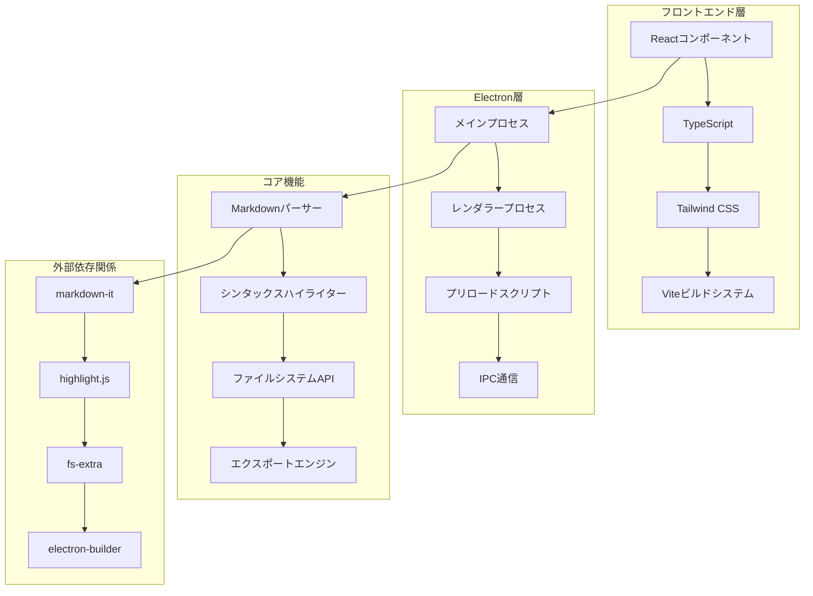

<div align="center">
  # MDoc - モダンMarkdownエディタ
  
  [](https://github.com/siro2462/mdoc/releases)
  [](LICENSE)
  [](https://github.com/siro2462/mdoc/releases)
  [](https://electronjs.org/)
  
  **Electron、React、TypeScriptで構築されたモダンで機能豊富なMarkdownエディタ**
  
  [📥 最新版をダウンロード](https://github.com/siro2462/mdoc/releases/latest) | [📖 ドキュメント](#ドキュメント) | [🐛 バグ報告](https://github.com/siro2462/mdoc/issues) | [💡 機能要望](https://github.com/siro2462/mdoc/issues)
</div>

---

## ✨ 機能

### 📁 **プロジェクト管理**
- **フォルダベースのワークフロー** - プロジェクトフォルダ全体を開く
- **スマートファイルツリー** - `.gitignore`や`node_modules`を自動除外
- **リアルタイムファイル監視** - ファイルシステムの変更を検出
- **マルチファイル対応** - 複数のMarkdownファイルをシームレスに切り替え

### ✏️ **高度なエディタ**
- **リアルタイムMarkdown編集**とライブプレビュー
- **自動保存機能**（1秒間の非アクティブ後に保存、オプションで有効/無効切り替え可能）
- **カスタムテキストエリア**による編集
- **行番号**表示とスクロール同期
- **画像ドラッグ&ドロップ**とクリップボード貼り付け対応
- **カスタマイズ可能なテーマ**（ライト/ダークモード）

### 👁️ **リッチプレビュー**
- **ライブプレビュー**でQiitaスタイルレンダリング
- **目次**の自動生成
- **コードブロック**のシンタックスハイライト
- **レスポンシブデザイン**でコンテンツに適応
- **ダーク/ライトモード**対応

### 💾 **エクスポート・共有**
- **単一HTMLファイルエクスポート**（CSS埋め込み）
- **スタイリングとフォーマット**を保持
- **ポータブル出力** - どのシステムでも動作
- **カスタムエクスポートテンプレート**

### 🎨 **モダンUI/UX**
- **リサイズ可能パネル**とドラッグ&ドロップスプリッター
- **直感的なナビゲーション**とボタンベースの操作
- **レスポンシブレイアウト**で様々な画面サイズに対応
- **カスタムウィンドウコントロール**（最小化、最大化、閉じる）
- **ファイルタブ**と未保存状態の視覚的表示

---

## 🚀 クイックスタート

### 📥 **ダウンロード・インストール**

1. [リリース](https://github.com/siro2462/mdoc/releases/latest)からインストーラーをダウンロード
2. `MDoc Setup 1.0.0.exe`を実行
3. インストールウィザードに従う
4. デスクトップまたはスタートメニューからMDocを起動

### 🏃‍♂️ **最初のステップ**

1. 📁ボタンをクリックしてプロジェクトフォルダを開く
2. ファイルツリーからMarkdownファイルを選択
3. 編集を開始 - 右側でライブプレビューを確認
4. 準備ができたら📥ボタンでHTMLにエクスポート

---

## 📋 システム要件

| コンポーネント | 要件 |
|-----------|-------------|
| **OS** | Windows 10/11 (64-bit) |
| **RAM** | 4GB以上、8GB推奨 |
| **ストレージ** | 200MB以上の空き容量 |
| **ディスプレイ** | 1024x768以上の解像度 |

---

## 🏗️ アーキテクチャ



### 🔧 **技術スタック**

| 層 | 技術 | 目的 |
|-------|------------|---------|
| **フロントエンド** | React 18 + TypeScript | UIコンポーネントと状態管理 |
| **スタイリング** | Tailwind CSS | レスポンシブデザインとテーマ |
| **ビルドツール** | Vite | 高速開発と最適化ビルド |
| **デスクトップ** | Electron 38 | クロスプラットフォームデスクトップアプリ |
| **Markdown** | markdown-it + markdown-it-anchor | Markdownパースとレンダリング |
| **シンタックス** | highlight.js | コードシンタックスハイライト |
| **アイコン** | カスタムSVG + vite-plugin-svgr | スケーラブルベクターアイコン |
| **ファイル操作** | fs-extra | ファイルシステム操作 |
| **パッケージング** | electron-builder | アプリケーション配布 |

---

## 📖 ドキュメント

### 🎯 **コアワークフロー**

#### **プロジェクトを開く**
```bash
1. 📁「フォルダを開く」ボタンをクリック
2. プロジェクトディレクトリに移動
3. Markdownファイルを含むフォルダを選択
4. ファイルツリーが自動的に読み込まれる
```

#### **Markdownを編集**
```bash
1. ファイルツリーから任意の.mdファイルをクリック
2. エディタパネルで入力開始
3. 右側のライブプレビューでリアルタイム確認
4. 効率化のためキーボードショートカットを使用
```

#### **HTMLにエクスポート**
```bash
1. Markdownコンテンツを編集
2. 📥「エクスポート」ボタンをクリック
3. エクスポート場所を選択（デフォルト：同じフォルダ）
4. 生成されたHTMLファイルを任意のブラウザで開く
```

### ⌨️ **キーボードショートカット**

| ショートカット | アクション |
|----------|--------|
| `Ctrl + S` | 現在のファイルを保存 |
| `Ctrl + V` | 画像をクリップボードから貼り付け |
| ヘッダーボタン | プロジェクトフォルダを開く |
| ヘッダーボタン | HTMLにエクスポート |
| ヘッダーボタン | ダーク/ライトモード切り替え |
| ヘッダーボタン | 自動保存の有効/無効切り替え |

### 📝 **対応Markdown機能**

| 機能 | 構文 | 例 |
|---------|--------|---------|
| **見出し** | `# ## ###` | `# メインタイトル` |
| **太字/斜体** | `**太字** *斜体*` | `**重要** *注意*` |
| **リスト** | `- * 1.` | `- 項目1` |
| **コード** | `` `コード` `` | `` `console.log()` `` |
| **コードブロック** | ```` ```言語` | ```` ```javascript` |
| **リンク** | `[テキスト](URL)` | `[GitHub](https://github.com)` |
| **画像** | `` | `` |
| **Base64画像** | `` | クリップボードから自動挿入 |
| **テーブル** | `\| 列 \| 列 \|` | `\| 名前 \| 値 \|` |
| **引用** | `> 引用` | `> 重要な注意` |
| **水平線** | `---` | `---` |
| **チェックボックス** | `- [ ] タスク` | `- [x] 完了済み` |

---

## 🔮 実装予定機能

### 🚀 **近々実装予定**

- **検索置換機能** - エディタ内での検索・置換機能
- **チェックボックス表示機能** - Preview/ExportHTMLでチェックボックス対応
- **レイアウト調整** - Preview/ExportHTMLのレイアウトカスタマイズ

### 🎯 **中期実装予定**

- **MDボタン** - テーブル、リスト、連番リストなどのボタンからMD形式文字列挿入
- **プリセットMD呼び出し機能** - 3つほどお気に入りのMDを登録可能
- **ExportHTMLのダークライトモード選択機能** - エクスポート時のテーマ選択

### 🔮 **長期実装予定**

- **コード比較機能** - ファイル間の差分比較
- **バージョン管理・比較機能** - Git統合とバージョン履歴管理

---

## 🛠️ 開発

### 🚀 **開発環境セットアップ**

```bash
# リポジトリをクローン
git clone https://github.com/siro2462/mdoc.git
cd mdoc

# 依存関係をインストール
npm install

# 開発サーバーを起動
npm run dev

# 開発モードでElectronを実行
npm run electron:dev
```

### 🔨 **ビルドコマンド**

```bash
# Reactアプリをビルド
npm run build

# Electronアプリをビルド
npm run electron-build

# Windowsインストーラーを作成
npm run build:win

# macOSインストーラーを作成
npm run build:mac

# Linuxインストーラーを作成
npm run build:linux
```

### 📁 **プロジェクト構造**

```
mdoc/
├── components/            # Reactコンポーネント
│   ├── Icon.tsx          # SVGアイコンコンポーネント
│   ├── Header.tsx        # ヘッダーコンポーネント
│   ├── EditorPanel.tsx   # エディタパネル
│   ├── PreviewPanel.tsx  # プレビューパネル
│   ├── FileExplorer.tsx  # ファイルエクスプローラー
│   └── ResizablePanels.tsx # リサイズ可能パネル
├── electron/              # Electronメインプロセス
│   ├── main.cjs          # メインプロセス
│   └── preload.cjs       # プリロードスクリプト
├── public/                # パブリックアセット
│   └── icons/            # SVGアイコンファイル
├── utils/                 # ユーティリティ関数
│   └── markdown.ts       # Markdownパーサー
├── dist/                  # ビルド出力
│   ├── MDoc Setup 1.0.0.exe  # Windowsインストーラー
│   └── win-unpacked/      # アンパック済みアプリ
├── App.tsx               # メインアプリケーション
├── types.ts              # TypeScript定義
└── package.json          # プロジェクト設定
```

---

## 🐛 トラブルシューティング

### ❓ **よくある問題**

#### **アイコンが表示されない**
- 最新版を使用していることを確認
- アプリケーションを再起動してみる
- アンチウイルスがアプリをブロックしていないか確認

#### **ファイルが保存されない**
- ファイルの権限を確認
- ファイルが他のプログラムで開かれていないか確認
- 別の場所に保存してみる

#### **エクスポートが動作しない**
- Markdownファイルが有効か確認
- 空きディスク容量を確認
- 別のフォルダにエクスポートしてみる

#### **パフォーマンスの問題**
- 他のアプリケーションを閉じてメモリを解放
- アプリケーションを再起動してみる
- プロジェクトフォルダが大きすぎないか確認

### 📞 **ヘルプを求める**

- **🐛 バグ報告**: [GitHub Issues](https://github.com/siro2462/mdoc/issues)
- **💡 機能要望**: [GitHub Discussions](https://github.com/siro2462/mdoc/discussions)
- **📧 連絡先**: [Email Support](mailto:support@mdoc.app)

---

## 🤝 貢献

私たちは貢献を歓迎します！詳細は[貢献ガイド](CONTRIBUTING.md)をご覧ください。

### 🎯 **貢献方法**

1. **リポジトリをフォーク**
2. **機能ブランチを作成** (`git checkout -b feature/amazing-feature`)
3. **変更をコミット** (`git commit -m 'Add amazing feature'`)
4. **ブランチにプッシュ** (`git push origin feature/amazing-feature`)
5. **プルリクエストを開く**

---

## 📄 ライセンス

このプロジェクトはMITライセンスの下でライセンスされています。詳細は[LICENSE](LICENSE)ファイルをご覧ください。

---

## 🙏 謝辞

- **Electron** - 素晴らしいデスクトップアプリフレームワーク
- **React** - 強力なUIライブラリ
- **Vite** - 高速ビルドツール
- **markdown-it** - Markdownパーサー
- **highlight.js** - シンタックスハイライト
- **Tailwind CSS** - ユーティリティファーストCSSフレームワーク

---

<div align="center">
  <p>MDocチームが❤️で作成</p>
  <p>
    <a href="https://github.com/siro2462/mdoc">⭐ GitHubでスター</a> •
    <a href="https://github.com/siro2462/mdoc/issues">🐛 バグ報告</a> •
    <a href="https://github.com/siro2462/mdoc/discussions">💬 ディスカッション</a>
  </p>
</div>