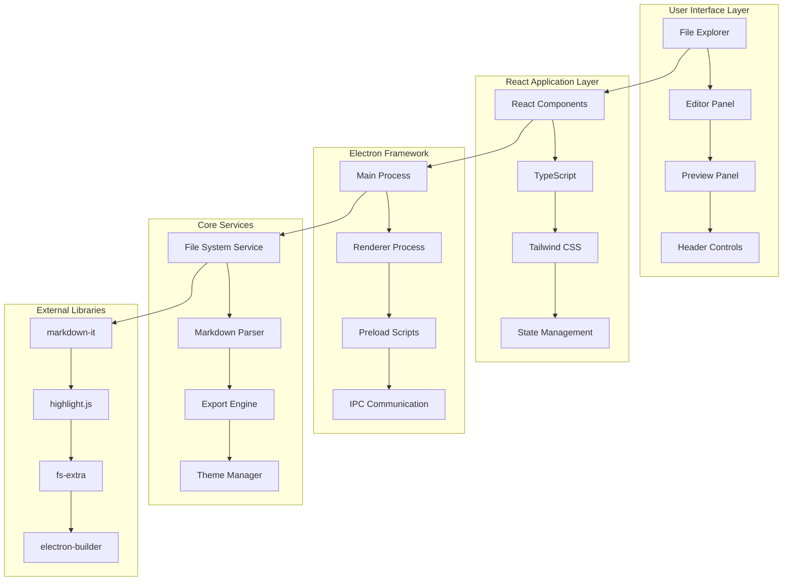
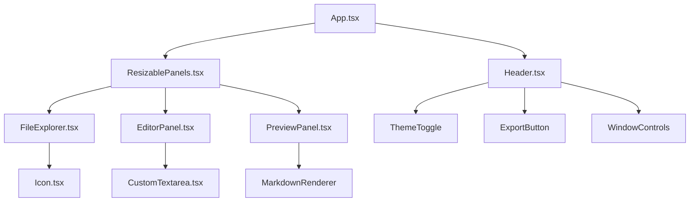
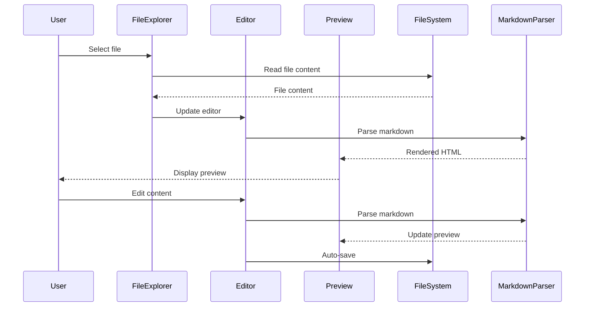

# MDoc Architecture

## System Overview

MDoc is built using a modern desktop application architecture that combines web technologies with native desktop capabilities through Electron.

## High-Level Architecture



## Component Architecture

### Frontend Components



### Data Flow



## Technology Stack

### Frontend Technologies

| Technology | Version | Purpose |
|------------|---------|---------|
| **React** | 18.2.0 | UI component library |
| **TypeScript** | 5.8.2 | Type-safe JavaScript |
| **Tailwind CSS** | Latest | Utility-first CSS framework |
| **Vite** | 5.4.0 | Build tool and dev server |

### Desktop Technologies

| Technology | Version | Purpose |
|------------|---------|---------|
| **Electron** | 38.0.0 | Desktop app framework |
| **electron-builder** | 25.1.0 | App packaging and distribution |
| **Node.js** | 18+ | Runtime environment |

### Markdown Processing

| Technology | Version | Purpose |
|------------|---------|---------|
| **markdown-it** | 14.0.0 | Markdown parser |
| **markdown-it-anchor** | 9.2.0 | Header anchor generation |
| **highlight.js** | 11.9.0 | Syntax highlighting |

### File System

| Technology | Version | Purpose |
|------------|---------|---------|
| **fs-extra** | 11.2.0 | Enhanced file system operations |
| **Node.js fs** | Built-in | Core file system API |

## File Structure

```
mdoc/
├── src/                          # Source code
│   ├── components/               # React components
│   │   ├── Icon.tsx             # SVG icon component
│   │   ├── FileExplorer.tsx     # File tree component
│   │   ├── EditorPanel.tsx      # Markdown editor
│   │   ├── PreviewPanel.tsx     # Live preview
│   │   ├── Header.tsx           # App header
│   │   └── ResizablePanels.tsx  # Layout management
│   ├── assets/                  # Static assets
│   │   └── icons/               # SVG icons
│   └── utils/                   # Utility functions
│       └── markdown.ts          # Markdown processing
├── electron/                    # Electron main process
│   ├── main.cjs                 # Main process entry
│   └── preload.cjs              # Preload scripts
├── public/                      # Public assets
│   └── icons/                   # Public icons
├── dist/                        # Build output
│   ├── MDoc Setup 1.0.0.exe     # Windows installer
│   └── win-unpacked/            # Unpacked application
├── docs/                        # Documentation
│   ├── architecture.md          # This file
│   └── screenshots/             # Screenshots
└── types.ts                     # TypeScript definitions
```

## Security Considerations

### File System Access
- **Sandboxed renderer process** - Limited file system access
- **Preload scripts** - Secure IPC communication
- **User-initiated actions** - All file operations require user interaction

### Content Security
- **SVG icon validation** - Only allowlisted icons can be loaded
- **Markdown sanitization** - Safe HTML rendering
- **No eval() usage** - Prevents code injection

### Electron Security
- **Context isolation** - Separates main and renderer contexts
- **Node integration disabled** - Prevents direct Node.js access from renderer
- **Secure default settings** - Follows Electron security best practices

## Performance Optimizations

### Build Optimizations
- **Vite bundling** - Fast builds and HMR
- **Tree shaking** - Remove unused code
- **Code splitting** - Lazy load components
- **Asset optimization** - Compress images and icons

### Runtime Optimizations
- **Debounced auto-save** - Prevent excessive file writes
- **Virtual scrolling** - Handle large file trees
- **Memoized components** - Prevent unnecessary re-renders
- **Lazy loading** - Load icons on demand

### Memory Management
- **Component cleanup** - Proper useEffect cleanup
- **Event listener removal** - Prevent memory leaks
- **File watcher cleanup** - Dispose watchers properly

## Development Workflow

### Local Development
```bash
npm run dev          # Start Vite dev server
npm run electron:dev # Start Electron with dev server
```

### Building
```bash
npm run build        # Build React app
npm run build:win    # Create Windows installer
```

### Testing
```bash
npm run preview      # Preview built app
npm run electron     # Run packaged app
```

## Deployment Architecture

### Windows Distribution
- **NSIS installer** - Professional installation experience
- **Auto-updater** - Built-in update mechanism
- **Code signing** - Optional code signing support
- **Desktop shortcuts** - User-friendly shortcuts

### File Packaging
- **ASAR packaging** - Secure app bundle
- **Resource optimization** - Minimize package size
- **Dependency bundling** - Include all required libraries

## Future Enhancements

### Planned Features
- **Plugin system** - Extensible architecture
- **Multi-window support** - Multiple project windows
- **Cloud sync** - Sync projects across devices
- **Collaborative editing** - Real-time collaboration

### Technical Improvements
- **WebAssembly integration** - Performance-critical operations
- **Service worker** - Offline functionality
- **Progressive Web App** - Web version support
- **Mobile companion** - Mobile app integration
